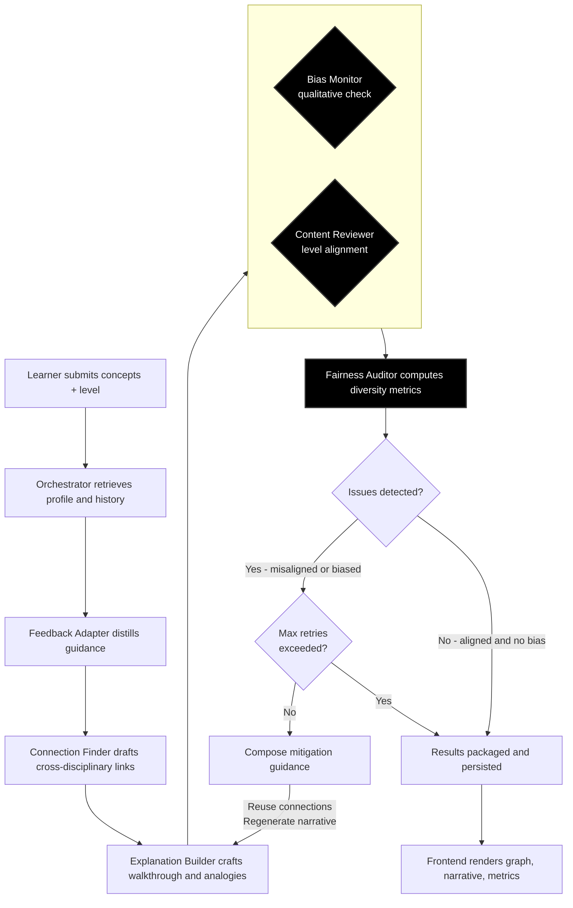

## 🧠 Interdisciplinary Concept Connector 

A local multi-agent AI system that discovers and explains connections between concepts across different disciplines — built with **Flask**, **Ollama**, and a lightweight front‑end using **HTML/CSS/JS**.

---

## 🚀 Features

### 💬 Multi-Agent Workflow

| Agent                  | Role        | Description                                                     |
| ---------------------- | ----------- | --------------------------------------------------------------- |
| 🧩 Orchestrator        | Coordinator | Handles queries, manages memory, and synthesizes outputs        |
| 🔗 Connection Finder   | Discovery   | Finds conceptual links between two ideas using the LLM          |
| 📘 Explanation Builder | Education   | Crafts level‑adapted explanations plus tailored analogies       |
| 🛡️ Content Reviewer    | Quality     | Verifies level alignment and surfaces actionable refinements    |
| ⚖️ Bias Monitor        | Fairness    | Detects and flags bias or cultural imbalance in results         |
| 📊 Fairness Auditor    | Metrics     | Computes transparency metrics (discipline diversity, language)  |
| 🔁 Feedback Adapter    | Memory      | Turns learner feedback into prompt guidance for future outputs  |

---

## 🏗️ Architecture Overview

### Backend (Flask)

* REST API with routes under `/api/` for concept connection, feedback, and profile.
* SQLite database for storing conversations, user preferences, and feedback.
* Modular agent classes and centralized prompt templates.
* Reviewer + fairness agents trigger automatic mitigation passes when level or bias issues are detected.

### 🔄 System Workflow



1. **Context gathering** – The orchestrator loads learner profile traits, prior interactions, and the latest feedback to seed downstream prompts.
2. **Guidance synthesis** – FeedbackAdapter summarizes the most relevant learner comments so each creative agent receives actionable suggestions.
3. **Generation cascade** – ConnectionFinder maps the bridge while ExplanationBuilder now returns both the explanation and analogy set in one call to keep guidance consistent.
4. **Quality and fairness review** – BiasMonitor flags qualitative concerns while FairnessAuditor produces transparency metrics (discipline spread, geographic balance, language variety).
5. **Content verification** – ContentReviewer checks that explanations match the requested knowledge level and highlights refinement opportunities.
6. **Mitigation pass** – If reviewer or fairness checks fail, the orchestrator re-prompts the necessary agents with corrective guidance before finalizing the response.
7. **Delivery & persistence** – Final artifacts, metrics, and applied mitigations are stored via the memory service and surfaced in the UI alongside a feedback form for continuous improvement.

### Frontend (Vanilla JS)

* Responsive **two-column layout**: concept input on the left, results on the right.
* Dynamic visualization using **D3.js** to draw concept graphs.
* Sections for explanations, analogies, reviewer verdicts, fairness metrics, and bias review with styled Markdown output.
* Built-in feedback form that posts ratings/comments back to the backend for continuous adaptation.

### Local LLM Integration

* Uses **Ollama** for local inference (default: `gemma3:4b`).
* Prompts optimized for reasoning and clarity.

---

## 🧩 Project Structure

```
project/
├── app.py
├── agents/
│   ├── orchestrator.py
│   ├── connection_finder.py
│   ├── explanation_builder.py
│   ├── bias_monitor.py
│   ├── content_reviewer.py
│   ├── fairness_auditor.py
│   └── feedback_adapter.py
├── services/
│   ├── ollama_service.py
│   ├── memory_service.py
│   ├── profile_service.py
│   └── text_formatter.py
├── prompts/templates.py
├── static/
│   ├── css/style.css
│   └── js/main.js
├── templates/
│   ├── base.html
│   └── index.html
├── database/
│   ├── app.db
│   └── schema.sql
└── requirements.txt
```

---

## ⚙️ Installation

### 1. Clone and Set Up Environment

```bash
git clone https://github.com/IThioye/Concept-Connector.git
cd Concept-Connector
python -m venv .venv
.venv\Scripts\activate   # or source .venv/bin/activate on Linux
pip install -r requirements.txt
```

### 2. Start Ollama

Install and run [Ollama](https://ollama.ai):

```bash
ollama pull gemma3:4b
ollama serve
```

### 3. Run the Flask App

```bash
python app.py
```

Then open **[http://localhost:5000](http://localhost:5000)** in your browser.

---

## 🖥️ Usage

1. Enter two concepts and select a knowledge level (beginner/intermediate/advanced).
2. The system will:

   * Find connections.
   * Build explanations & analogies.
   * Check for bias.
3. View:

   * A D3 graph of conceptual links.
   * Cleanly formatted explanations and analogies.
   * Reviewer verdicts and fairness metrics.
   * Bias review results and any applied mitigation guidance.
   * A feedback form to steer future generations.

4. Submit optional feedback so the next responses better match your expectations.

---

## 🎨 Frontend Layout

```
+-----------------------------------------------------------+
|  Concepts (Left)       |  Results (Right)                 |
|-------------------------|---------------------------------|
|  [Concept A]            |  Connection Graph (D3)          |
|  [Concept B]            |  Explanations (Markdown → HTML) |
|  [Level Dropdown]       |  Analogies (HTML Lists)         |
|  [Submit Button]        |  Bias Review                   |
+-----------------------------------------------------------+
```

---

## 🧠 Customization

* Change the LLM model in `services/ollama_service.py`.
* Modify prompt templates in `prompts/templates.py`.
* Adjust UI colors and layout in `static/css/style.css`.


---

## 🧪 Example Query

**Concept A:** Photosynthesis
**Concept B:** Solar Panels
**Knowledge Level:** Intermediate

Produces:

* Connection graph (Biology → Energy Conversion → Engineering)
* Step‑by‑step explanation
* 2–3 analogies rendered as HTML
* Bias review feedback

---

## 🧰 Requirements

```
flask==3.0.0
requests==2.31.0
chromadb==0.4.18
pandas
matplotlib
textstat
```

---

## 🧩 Limitations & Future Work

* Sequential agent calls can still be optimized for latency despite async orchestration.
* Bias mitigation performs a single corrective pass; additional iterations or human review may be desirable for high-stakes use.
* Fairness metrics rely on lightweight heuristics—consider complementing them with corpus-based evaluation.
* Feedback adaptation is session-scoped and does not yet support multi-user personalization with authentication.

---


**Created as part of the *Future of AI – Concept Connector* project.**
